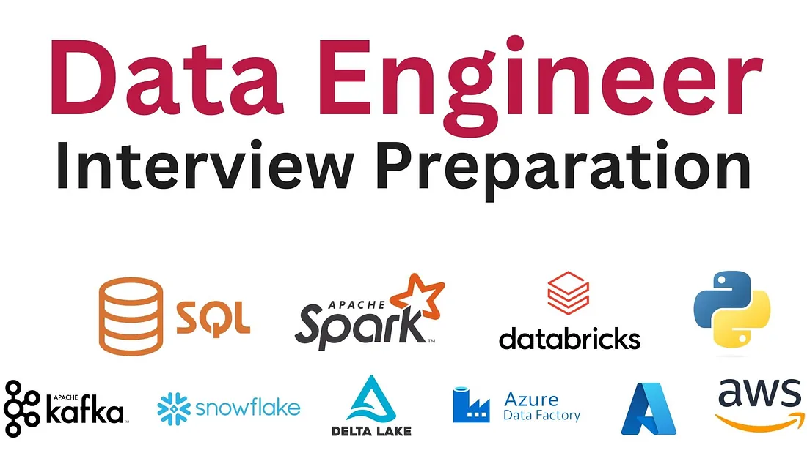

# DE-Interview-Notes

This repository contains curated notes, concepts, and study resources to help prepare for Data Engineering interviews. The goal is to provide a concise and well-structured collection of key topics and hands-on knowledge required for entry-level to mid-level Data Engineer roles. The notes are not mine, they're collected from various internet sources.

## 📘 Contents

- SQL Practice & Concepts
- Data Warehousing & ETL
- Big Data Tools (Hadoop, Spark, Kafka, etc.)
- Cloud Services (AWS, GCP, Azure basics)
- Data Modeling
- System Design for Data Pipelines
- Python for Data Engineering
- Git, Linux & Shell Scripting
- Mock Interview Questions & Answers

## 📌 Usage

You can:

- Review and revise key concepts before interviews
- Use notes as a reference for self-study
- Practice answering real interview-style questions

## 🚀 How to Contribute

If you'd like to add more content or correct anything:

1. Fork the repo
2. Create a new branch
3. Make your changes
4. Open a pull request

## 🙌 Acknowledgements

Thanks to mentors, peers, and online communities for providing great insights and materials that inspired these notes.

---

Happy learning and good luck with your interviews! 🚀
